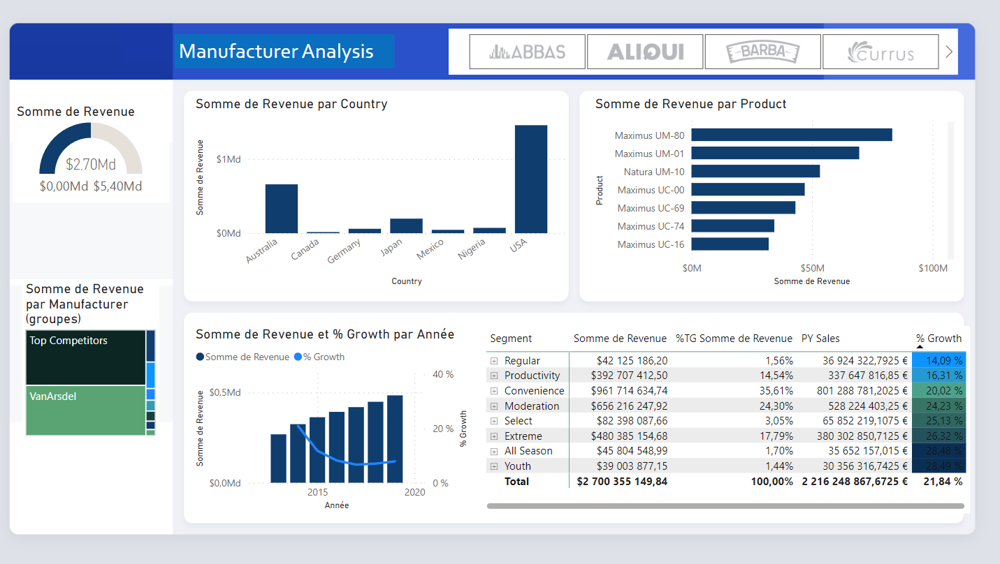

# Manufacturing Analysis with Power Query and Power BI

This project utilizes Power Query and Power BI for manufacturing analysis. It allows users to gain insights into manufacturing processes, track key performance indicators (KPIs), and visualize data for informed decision-making.

## Features

- **Data Integration:** Leverage Power Query to connect, transform, and load manufacturing data from various sources.
  
- **Data Modeling:** Utilize Power BI's data modeling capabilities to create relationships, calculations, and aggregations for a comprehensive view of manufacturing metrics.

- **Visualization:** Design interactive and meaningful dashboards using Power BI to visualize manufacturing performance indicators.

- **Automation:** Implement automated data refreshes and updates for real-time monitoring of manufacturing data.

## Requirements

- [Power BI Desktop](https://powerbi.microsoft.com/desktop/)
- Knowledge of Power Query for data transformation
- Access to manufacturing data sources

## Setup

1. Install [Power BI Desktop](https://powerbi.microsoft.com/desktop/) on your machine.

2. Clone the repository:

    ```bash
    git clone https://github.com/AyoubSmirani7080/Manufacture-Analysis.git
    cd Manufacturing-Analysis
    ```

3. Open the project in Power BI Desktop.

4. Load and transform manufacturing data using Power Query.

5. Design dashboards and visualizations to suit your manufacturing analysis needs.

6. Save and publish the Power BI report to the Power BI service for sharing and collaboration.

## Usage

- Open the Power BI report in Power BI Desktop.

- Navigate through the dashboards and visualizations to analyze manufacturing data.

- Use the Power BI service for sharing and collaboration with team members.

## Project Structure

- `data/`: Directory containing sample manufacturing data files.
- `queries/`: Power Query scripts for data transformation.
- `reports/`: Power BI reports and dashboards.
## Visualization 




## Contributing

Feel free to contribute to enhance and extend the manufacturing analysis capabilities. Create a pull request with your improvements.

## Acknowledgments

- This project is inspired by the need for data-driven manufacturing decisions.

Happy analyzing!

